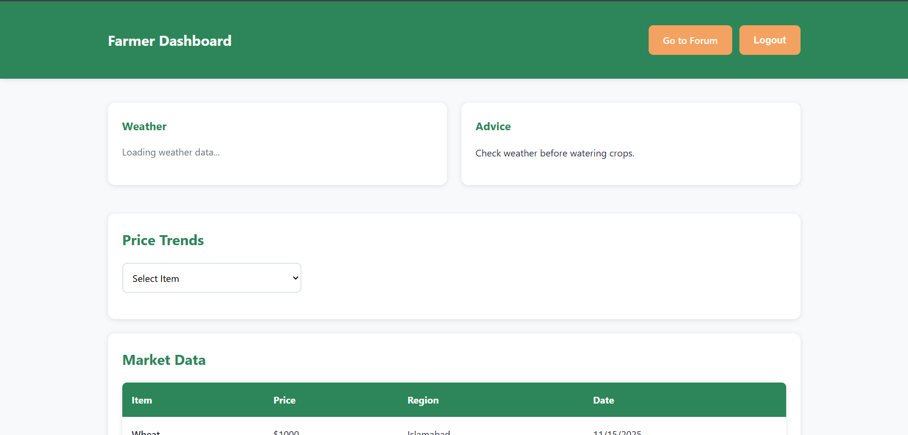
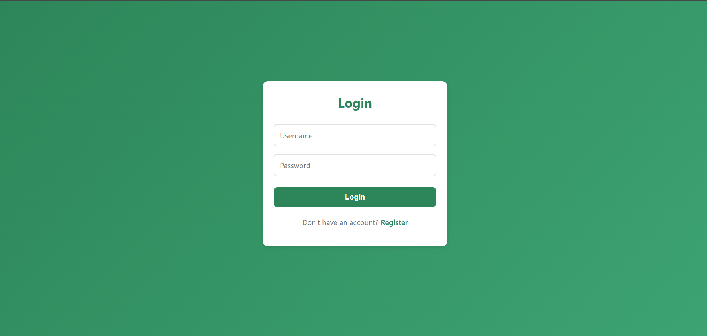
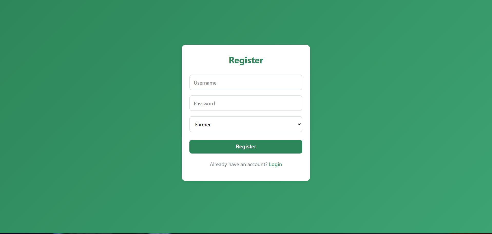
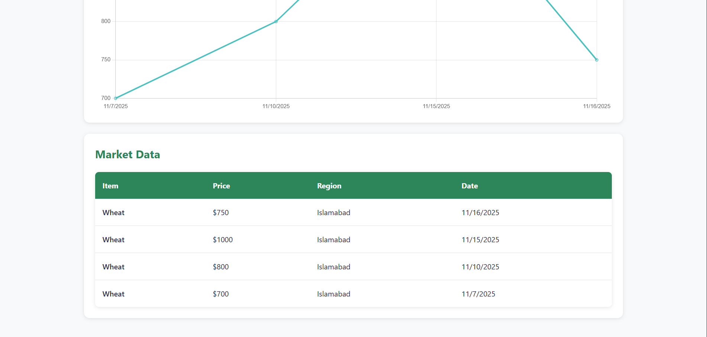
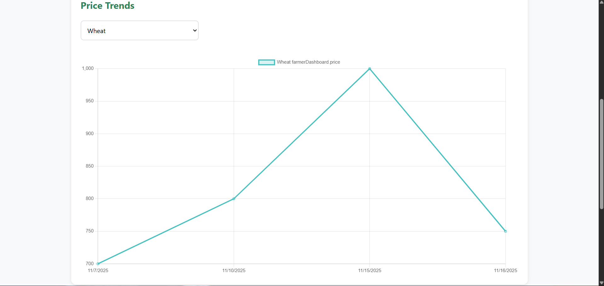
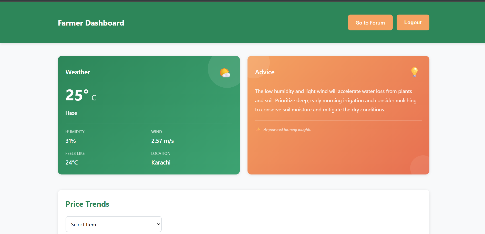
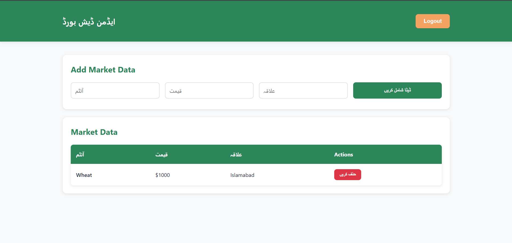
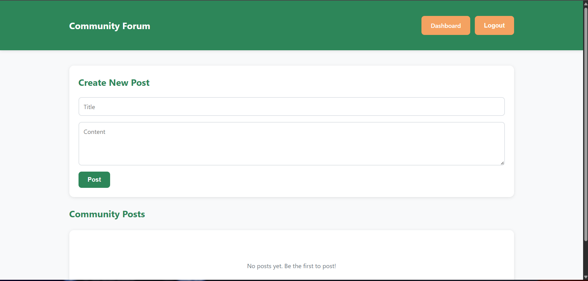

# 🌾 FarmView

A calm and intuitive platform for tracking agricultural market data with farmer and admin dashboards, community forum, and weather integration.

## 📌 Project Origin

This project was inspired by a task given during the **TechFest at COMSATS Islamabad** in the **first week of November**. While I didn't participate in the techfest, I found the idea quite interesting and decided to implement it on my own.

**Built solo in approximately 2 hours** - A full-stack application with modern UI, authentication, role-based access, multilingual support, real-time market data tracking, AI-powered farming advice via Google Gemini API, and weather integration via OpenWeatherMap.


*Modern, clean interface for agricultural market tracking*

## 📸 Screenshots

### Authentication Flow

#### Login Page

*Beautiful gradient login interface*

#### Register Page

*Simple and intuitive registration form for farmers and admins*

#### Language Selection

*Choose between English and Urdu languages*

### User Dashboards

#### Farmer Dashboard - Market Data & Prices

*Real-time market data organized by item and region*

#### Farmer Dashboard - Price Trends Visualization

*Interactive charts showing price trends over time*

#### Farmer Dashboard - Weather & Advice

*Current weather conditions and AI-generated farming advice*

#### Admin Dashboard

*Admin panel for managing market data and agricultural products (shown in Urdu)*

### Community Forum

*Interactive forum for farmers to share knowledge and experiences*


## Prerequisites

- Node.js (v14 or higher)
- MongoDB (local or cloud instance)
- npm or yarn
- OpenWeatherMap API Key (optional, for weather features)
- Google Gemini API Key (optional, for AI farming advice)

## Setup Instructions

### 1. Install Dependencies

#### Backend
```bash
cd backend
npm install
```

#### Frontend
```bash
cd frontend
npm install
```

### 2. Environment Variables

Create a `.env` file in the `backend` directory:

```env
MONGO_URI=mongodb://localhost:27017/farmview
JWT_SECRET=your-secret-key-here
PORT=5000
WEATHER_API_KEY=your-openweather-api-key (optional)
GEMINI_API_KEY=your-google-gemini-api-key (optional)
```

**Notes:** 
- If you don't have MongoDB installed locally, you can use [MongoDB Atlas](https://www.mongodb.com/cloud/atlas) (free tier available) and set `MONGO_URI` to your connection string.
- Get your OpenWeatherMap API key from [OpenWeatherMap](https://openweathermap.org/api)
- Get your Google Gemini API key from [Google AI Studio](https://aistudio.google.com)

### 3. Start MongoDB

If using local MongoDB:
```bash
# Windows (if MongoDB is installed as a service, it should start automatically)
# Or start manually:
mongod

# Mac/Linux
sudo systemctl start mongod
# or
mongod
```

### 4. Run the Application

#### Terminal 1 - Backend Server
```bash
cd backend
npm start
# or for development with auto-reload:
npm run dev
```

The backend will run on `http://localhost:5000`

#### Terminal 2 - Frontend Server
```bash
cd frontend
npm start
```

The frontend will run on `http://localhost:3000` and open automatically in your browser.

## Usage

1. **Register a new account:**
   - Go to `http://localhost:3000/register`
   - Choose role: `farmer` or `admin`
   - Create your account

2. **Login:**
   - Go to `http://localhost:3000`
   - Enter your credentials
   - Select your preferred language (English/Urdu)

3. **Admin Features:**
   - Add, view, and delete market data
   - Manage agricultural product prices by region

4. **Farmer Features:**
   - View market data and price trends
   - Check weather information
   - Access farming advice
   - Participate in community forum

## 🏗️ Project Structure

```
farmview/
├── backend/
│   ├── app.js              # Express server setup
│   ├── models/             # MongoDB models
│   ├── routes/             # API routes
│   └── middleware/         # Auth middleware
├── frontend/
│   ├── src/
│   │   ├── components/     # React components
│   │   ├── locales/        # Translation files
│   │   └── App.js          # Main app component
│   └── public/
└── README.md
```

## 🎨 Features

- ✅ **Dual Language Support** - English and Urdu with i18next
- ✅ **Role-Based Access Control** - Separate dashboards for farmers and admins
- ✅ **Market Data Tracking** - Real-time price monitoring by region
- ✅ **Price Trends Visualization** - Interactive charts with Chart.js
- ✅ **Weather Integration** - Current weather data via OpenWeatherMap API
- ✅ **AI-Powered Farming Advice** - Intelligent recommendations using Google Gemini API
- ✅ **Community Forum** - Share knowledge and experiences with other farmers
- ✅ **Secure Authentication** - JWT-based authentication with password hashing
- ✅ **Modern UI** - Clean, responsive design with smooth animations

## ⚙️ Technologies Used

- **Backend:** Node.js, Express.js, MongoDB, Mongoose, JWT, Bcryptjs
- **APIs:** OpenWeatherMap (weather data), Google Generative AI (Gemini)
- **Frontend:** React 18, React Router v6, Chart.js, i18next
- **Styling:** CSS3 with CSS Variables for theming
- **Authentication:** JWT tokens with secure password hashing

## 🔌 API Endpoints

### Authentication Routes (`/api/auth`)
- `POST /register` - Register new user (farmer or admin)
- `POST /login` - User login with credentials

### Admin Routes (`/api/admin`) - *Requires Admin Role*
- `GET /market-data` - Get all market data
- `POST /market-data` - Add new market data
- `PUT /market-data/:id` - Update market data
- `DELETE /market-data/:id` - Delete market data

### Farmer Routes (`/api/farmer`) - *Requires Authentication*
- `GET /market-data` - Get all market data
- `GET /weather/:city` - Get current weather for a city
- `GET /advice` - Get AI-powered farming advice based on weather

### Forum Routes (`/api/forum`) - *Requires Authentication*
- `GET /posts` - Get all forum posts
- `POST /posts` - Create new post
- `PUT /posts/:id` - Update post (author only)
- `DELETE /posts/:id` - Delete post (author only)
- `GET /posts/:id/comments` - Get comments for a post
- `POST /posts/:id/comments` - Add comment to post

## 📋 Database Models

- **User**: Stores user credentials, username, role (admin/farmer)
- **MarketData**: Tracks item prices by region and date
- **Post**: Forum posts with title, content, and author
- **Comment**: Comments on forum posts


## � License

This project is open source and available for educational purposes.
